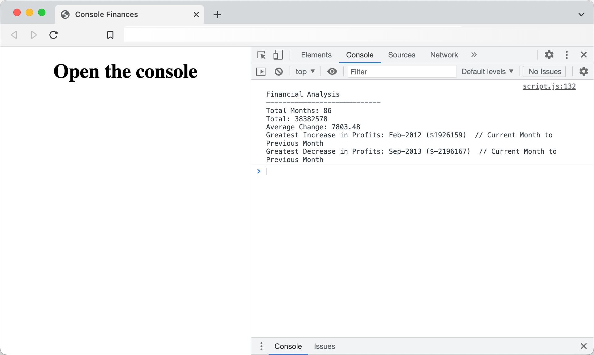

<br />
<div align="center">


<h1 align="center">Console Finances</h1>

  <p align="center" >
    <a href="https://agia.github.io/Console-Finances"><b>View Demo</b></a>
  </p>
</div>

## Description

<!-- TO BE ADDED -->
Using JavaScript, and given a dataset composed of arrays containing two fields, `Date` and `Profit/Losses`, this code analyses the dataset (found at the top of the `script.js`) and prints the results to the browser console, calculating each of the following:

- Total number of months included in the dataset.
- Net total of Profit/Losses over the entire period.
- Average of the changes in Profit/Losses over the entire period.
- The greatest increase in profits (date and amount) over the entire period of the dataset.
- The greatest decrease in losses (date and amount) over the entire period of the dataset.

An example output should look like the following:

```text
Financial Analysis
----------------------------
Total Months: 25
Total: $2561231
Average  Change: $-2315.12
Greatest Increase in Profits: Feb-2012 ($1926159)
Greatest Decrease in Profits: Sep-2013 ($-2196167)
```

## Usage

No installation needed, just check out [the demo here](https://agia.github.io/Console-Finances).

<!-- TO BE ADDED -->
Here is an example in use:
<br />


## Acknowledgments

MDN was a useful reference in this instance, particularly for `toFixed()` method, which I used to format the output to console:
- [MDN (Number.prototype.toFixed())](https://developer.mozilla.org/en-US/docs/Web/JavaScript/Reference/Global_Objects/Number/toFixed)

---
